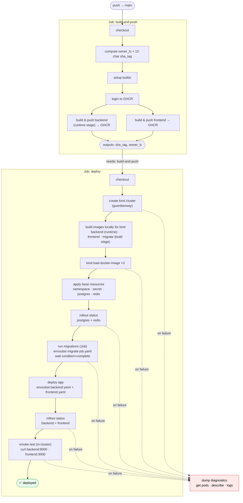

# GuardianWay — CD Deploy Flow

Source: `.github/workflows/cd.yml` (triggered on push to `main`). Two jobs: `build-and-push` publishes images to GHCR; `deploy` spins up a kind cluster and rolls out the app.

## Notes for the slide

- **Two images, three builds.** The runtime backend + frontend images are built once and pushed to GHCR in `build-and-push`. The `deploy` job rebuilds them locally (plus a third **migrate** image from the Dockerfile `build` stage) so kind can load them without pulling from GHCR.
- **Ordering is enforced by `rollout status` / `wait`.** Datastores must be `Ready` before migrations; migrations must `complete` before the app rolls out — otherwise the backend would start against an un-migrated schema.
- **`envsubst`** injects the image tag (`$SHA_TAG`, `$OWNER_LC`) into the k8s manifests at apply time.
- **Smoke test** hits `backend:8000` and `frontend:3000` from inside the cluster — fails the job if either is unreachable.
- **Failure branch** (`if: failure()`) dumps pods, `describe`, and logs for debugging — runs no matter which step broke.
