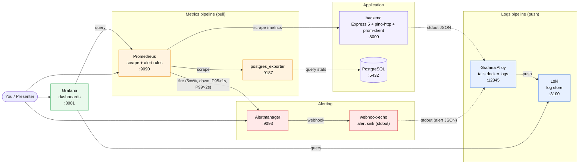

# GuardianWay — Observability Stack

```mermaid
flowchart LR
    user(["You / Presenter"])

    subgraph app["Application"]
        be["backend<br/>Express 5 + pino-http + prom-client<br/>:8000"]
        pg[("PostgreSQL<br/>:5432")]
    end

    subgraph metrics["Metrics pipeline (pull)"]
        pe["postgres_exporter<br/>:9187"]
        prom["Prometheus<br/>scrape + alert rules<br/>:9090"]
    end

    subgraph alerting["Alerting"]
        am["Alertmanager<br/>:9093"]
        wh["webhook-echo<br/>alert sink (stdout)"]
    end

    subgraph logs["Logs pipeline (push)"]
        alloy["Grafana Alloy<br/>tails docker logs<br/>:12345"]
        loki["Loki<br/>log store<br/>:3100"]
    end

    graf["Grafana<br/>dashboards<br/>:3001"]

    %% metrics
    prom -- "scrape /metrics" --> be
    prom -- "scrape" --> pe
    pe -- "query stats" --> pg

    %% alerting
    prom -- "fire (5xx%, down, P95>1s, P99>2s)" --> am
    am -- "webhook" --> wh

    %% logs
    be -. "stdout JSON" .-> alloy
    wh -. "stdout (alert JSON)" .-> alloy
    alloy -- "push" --> loki

    %% visualization
    graf -- "query" --> prom
    graf -- "query" --> loki

    %% access
    user --> graf
    user --> prom
    user --> am

    classDef m fill:#fff3e0,stroke:#e8820c,color:#000
    classDef l fill:#e7f0ff,stroke:#2f6fed,color:#000
    classDef a fill:#ffe9e9,stroke:#d83a3a,color:#000
    classDef v fill:#e9f9ec,stroke:#2faa55,color:#000
    classDef ap fill:#f3f0ff,stroke:#6b4fd8,color:#000

    class pe,prom m
    class alloy,loki l
    class am,wh a
    class graf v
    class be,pg ap
```

